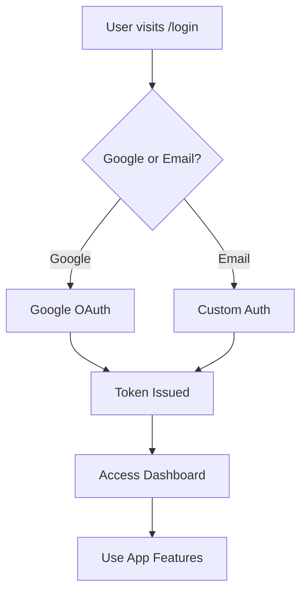

# 🏗️ ArchitechX - 3D Layout Design Platform


**ArchitechX** is a modern, full-featured 2D and 3D architectural layout generator. It empowers users to design, customize, and visualize architectural spaces with an intuitive web interface, leveraging the latest web technologies.

---

## 📚 Table of Contents

- [Overview](#overview)
- [Features](#features)
- [Tech Stack](#tech-stack)
- [Project Structure](#project-structure)
- [Routing Structure](#routing-structure)
- [Authentication Flow](#authentication-flow)
- [Component Overview](#component-overview)
- [Installation](#installation)
- [Configuration](#configuration)
- [Development](#development)
- [API Integration](#api-integration)
- [Deployment](#deployment)
- [Contributing](#contributing)
- [License](#license)

---

## 🔍 Overview

ArchitechX is a comprehensive web application for architectural design that enables users to:

- Create precise 2D floor plans
- Visualize designs in interactive 3D
- Customize materials, wall colors, and textures
- Export professional design documents
- Manage projects and templates
- Collaborate and save progress securely

---

## ✨ Features

- **User Authentication:** Secure login/signup with Google OAuth and custom forms.
- **2D Layout Generation:** Draw and edit floor plans with drag-and-drop tools.
- **3D Visualization:** Real-time rendering using Three.js for immersive design.
- **Customization:** Change wall colors, textures, and materials.
- **Project Management:** Save, edit, and export projects.
- **Templates:** Use and create reusable layout templates.
- **Responsive Dashboard:** Sidebar navigation and adaptive UI.
- **Microservice-ready Backend:** (Planned) Node.js, Express, MongoDB, Docker.
- **RESTful APIs:** For layout generation and project management.
- **Vastu Chatbot:** (Planned) AI-powered design suggestions.
- **Walk in mode:** Give a walking mode in the home.

---

## ⚙️ Tech Stack

| Layer         | Technology                        |
|---------------|-----------------------------------|
| Frontend      | React.js, Vite, Tailwind CSS      |
| 3D Rendering  | Three.js                          |
| Auth          | Firebase Auth, Google OAuth       |
| Routing       | React Router DOM                  |
| State         | React Hooks, Context API          |
| Backend*      | Node.js, Express.js, MongoDB      |
| APIs          | RESTful                           |
| Deployment    | Vercel/Netlify (Frontend), Docker |
| Testing       | Jest, React Testing Library       |

*Backend is planned for future releases.

---

## 🗂️ Project Structure

```
frontend/
├── public/
│   └── index.html
├── src/
│   ├── assets/                # Images, icons, static files
│   ├── components/            # Reusable UI components
│   │   ├── LoginForm.jsx
│   │   ├── SignupForm.jsx
│   │   ├── ForgotPasswordFlow.jsx
│   │   ├── Sidebar.jsx
│   │   ├── Profile.jsx
│   │   ├── CreateNewProject.jsx
│   │   ├── Projects.jsx
│   │   ├── Templates.jsx
│   │   └── VastuChatbotToggle.jsx
│   ├── pages/                 # Page-level components
│   │   ├── HomePage.jsx
│   │   ├── Dashboard.jsx
│   │   ├── LayoutForm.jsx
│   │   └── Editor.jsx
│   ├── styles/                # Tailwind and custom CSS
│   │   └── tailwind.css
│   ├── App.jsx                # Main app component (routing)
│   ├── main.jsx               # Entry point
│   └── types/                 # TypeScript types (if used)
│       └── index.ts
├── .env                       # Environment variables
├── package.json
├── tailwind.config.js
├── vite.config.js
└── README.md
```

---

## 🌐 Routing Structure

Routing is handled via `react-router-dom` in `App.jsx`:

```jsx
<GoogleOAuthProvider clientId="YOUR_GOOGLE_CLIENT_ID">
  <BrowserRouter>
    <Routes>
      <Route path="/" element={<HomePage />} />
      <Route path="/login" element={<LoginForm />} />
      <Route path="/signup" element={<SignupForm />} />
      <Route path="/forgot-password" element={<ForgotPasswordFlow />} />
      <Route path="/dashboard" element={<Dashboard />}>
        <Route path="profile" element={<Profile />} />
        <Route path="create-project" element={<CreateNewProject />} />
        <Route path="layout-form" element={<LayoutForm />} />
        <Route path="projects" element={<Projects />} />
        <Route path="templates" element={<Templates />} />
        <Route path="dynamic-canvas" element={<Editor />} />
        {/* Add more nested routes here */}
      </Route>
      {/* <Route path="/chatbot-vastu" element={<VastuChatbotToggle />} /> */}
    </Routes>
  </BrowserRouter>
</GoogleOAuthProvider>
```

### Route Descriptions

| Path                        | Component            | Description                        |
|-----------------------------|----------------------|------------------------------------|
| `/`                         | `HomePage`           | Landing page                       |
| `/login`                    | `LoginForm`          | User login                         |
| `/signup`                   | `SignupForm`         | New user registration              |
| `/forgot-password`          | `ForgotPasswordFlow` | Password recovery                  |
| `/dashboard`                | `Dashboard`          | User's main dashboard              |
| `/dashboard/profile`        | `Profile`            | Profile management                 |
| `/dashboard/create-project` | `CreateNewProject`   | Project initialization             |
| `/dashboard/layout-form`    | `LayoutForm`         | 2D layout input form               |
| `/dashboard/projects`       | `Projects`           | List of saved user projects        |
| `/dashboard/templates`      | `Templates`          | Default layout templates           |
| `/dashboard/dynamic-canvas` | `Editor`             | 3D layout design and edit          |

---

## 🔑 Authentication Flow

- **Google OAuth:** Users can sign in with Google for a seamless experience.
- **Custom Auth:** Email/password signup and login supported.
- **Password Recovery:** Users can reset forgotten passwords via email.
- **Protected Routes:** Dashboard and project pages require authentication.

**Flow Diagram:**



---

## 🧩 Component Overview

- **LoginForm / SignupForm:** Handles user authentication.
- **ForgotPasswordFlow:** Password reset UI.
- **Sidebar:** Navigation for dashboard.
- **Dashboard:** Main user area, contains nested routes.
- **Profile:** User profile management.
- **CreateNewProject:** Start a new design project.
- **LayoutForm:** Input dimensions, room types, etc.
- **Projects:** List and manage saved projects.
- **Templates:** Use or create layout templates.
- **Editor:** 3D design canvas using Three.js.
- **VastuChatbotToggle:** (Planned) AI design assistant.

---

## 🛠️ Installation

Clone the repository:

```bash
git clone https://github.com/aaradhayasingh811/architechx_frontend.git
cd architechx/frontend
```

Install dependencies:

```bash
npm install
```

---

## ⚙️ Configuration

Create a `.env` file in the root directory and add the following:

```
VITE_API_KEY=your_api_key_here
VITE_ANOTHER_API_KEY=your_other_key
VITE_GOOGLE_CLIENT_ID=your_google_client_id
```

> **Note:** Never commit your `.env` file to version control.

---

## 🚀 Development

To start the development server:

```bash
npm run dev
```

Open [http://localhost:5173](http://localhost:5173) to view the app.

---

## 🔌 API Integration

- **RESTful APIs:** Used for layout generation, project management, and authentication.
- **Endpoints:** Defined in the backend (planned).
- **API Calls:** Use `fetch` or `axios` in React components.

---

## 📦 Deployment

- **Frontend:** Deploy on Vercel, Netlify, or any static hosting.
- **Backend:** (Planned) Deploy with Docker, Node.js, MongoDB.
- **CI/CD:** Recommended to use GitHub Actions for automated builds and tests.

---

## 🤝 Contributing

1. **Fork** the repository.
2. **Create a branch:**  
   `git checkout -b feature/your-feature`
3. **Commit your changes:**  
   `git commit -m 'Add feature'`
4. **Push to your branch:**  
   `git push origin feature/your-feature`
5. **Open a Pull Request** on GitHub.

Please read `contributing.md` and adhere to the project's `code of conduct`.

---

## 📄 License

MIT License  
Copyright © 2025 ArchitechX

---

## 🙏 Acknowledgements

- [React](https://react.dev/)
- [Three.js](https://threejs.org/)
- [Tailwind CSS](https://tailwindcss.com/)
- [Firebase](https://firebase.google.com/)
- [Vite](https://vitejs.dev/)
- [Google OAuth](https://developers.google.com/identity)

---

## 💬 Contact

For questions, suggestions, or support, please open an issue or contact the maintainer via [GitHub](https://github.com/aaradhayasingh811).

---